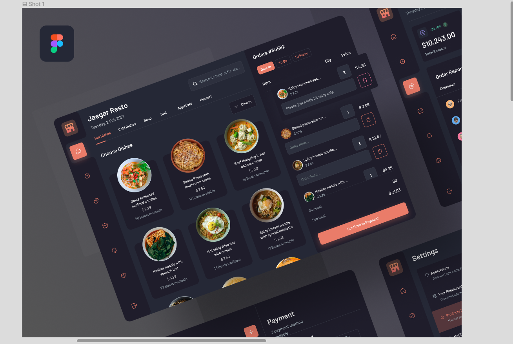

# PROJECT DOCUMENTATION

# PRIME CUISINE: FOOD ORDERING WEB APPLICATION
### This is a desktop web application.

## About The Project 

This is a food ordering DESKTOP web application. It is NOT optimized for mobile view. It grants user access to their dashboard where they can place order from different varieties of dishes, view and edit their profile, get to chat with the app's Sales Rep and get answers to their questions through the FAQ section, configure settings.

## Design Inspiration for the main page but with a little twitch 🤭
 

## Technologies Used

- React.js
- Typescript
- CSS and Tailwindcss for styling
- Supabase for Authentication
- Paystack Integration for payments
- LocalStorage to store and fetch data from the profile settings
- React-icons and Router
- Framer Motion for animation
- React Toastify 

## App Features

- Signup or Login functionality with Supabase.
- Shopping page with lists and categories of dishes that can be added to cart. The lists come with a filter function to filter dishes based on country cuisines. There is also a search functionality which users can use to search for available dishes on the app.
- Cart page to view food users have added to the cart. Here you can select number of dishes or delete a specific item. You meal cost along with a fixed delivery fee is now on users tab. Users can checkout for payment. Paystack integration functionality was enabled for this.
- Chat page for users to start a conversation with our sales rep.
- FAQ section to get answers to some questions about the application.
- Settings page to configure the application. This page is divided into 3 sections. 
   - Help and Support section to lay a complaint about the application or send a message to help resolve an issue.
   - Profile settings section consisting of a form for users to update their profile. This update can be viewed fully in profile page(/profile)
   - Security settings section consisting of a form for users to reset their password(this feature isn't functional yet).

## Sidebar Navigation 🔍

- Food Varieties 
- Profile
- Chat 
- Restaurant venue launch - Coming Soon 
- FAQs
- Settings
- Logout/Logout

## App Links 
Production Link: ()

Project Github Repo Link: (https://github.com/OmaJuliet/PRIME-CUISINE.git)

## Get it on your local machine
To get this React-Typescript application on your local machine, you need to follow these steps

## Prerequisites
- Node.js (v14.17.6 or later)
- npm (v6.14.15 or later)

### Installation
1. Clone the repository or download the source code from GitHub. To clone it, use this command "git clone repo-link"
2. Open a terminal or command prompt and navigate to the project directory.
3. Run `npm install` to install the project dependencies.

### Other dependencies
- Run `npm install react-router-dom@6` to install the router library
- Run `npm i framer-motion` to install the framer motion animation library
- Run `npm install react-paystack --save` to install the paystack library
- Run `npm install @supabase/supabase-js` to install the SupabaseJS library
- RUn `npm install @supabase/auth-ui-react @supabase/auth-ui-shared` to install the Supabase Auth UI library

### Running and Testing the application
2. Run `npm start` to start the development server.
3. Open a web browser and go to http://localhost:3000 to view the application.